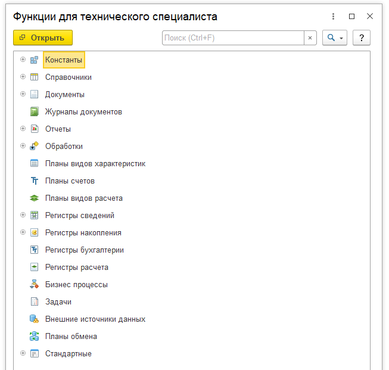
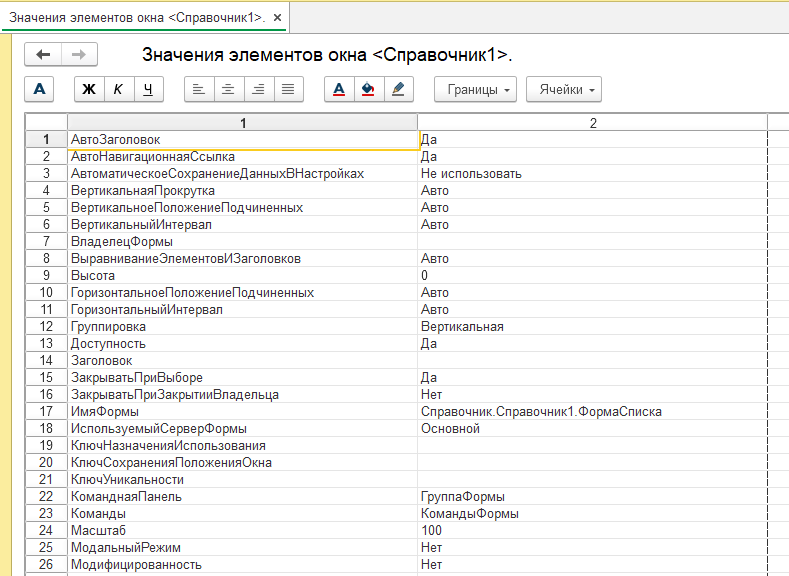
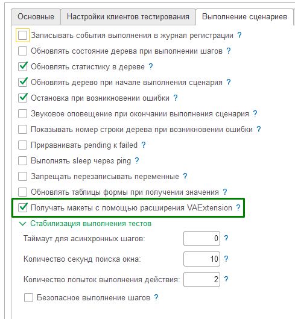

# Расширение VAExtension

**Расширение "VAExtension"** предназначено для решения ряда технологичесих задач при запуске автотестов.
Его необходимо установить в базу, в которой будет запускаться клиент тестирования.
Исходники расширения можно скачать [тут](https://github.com/Pr-Mex/vanessa-automation/tree/develop/lib/VAExtension).
Собранный cfe файл можно скачать в [секции релизов](https://github.com/Pr-Mex/vanessa-automation/releases).
Возможности расширения:


1. Открытие окна "Функции технического специалиста" (Все функции).
2. Выполнить ожидание завершения фоновых заданий на стороне клиента тестирования.
3. Получить навигационную ссылку окна для любых окон, у которых возможно получить навигационную ссылку.
4. Выполнить произвольный код на стороне клиента тестирования (клиентский код и серверный код).
5. Вычислить произвольное выражение на стороне клиента тестирования (клиентский код и серверный код).
6. Получить произвольное значение из реквизита формы или объекта связанного с формой.
7. Изменять произвольные данные формы, доступные для записи.
8. Выполнить метод текущей формы.
9. Получать макеты из формы клиента тестирования без использования временных файлов. Также работает в web клиенте.
10. Открытие окна "Настройка начальной страницы"
11. Взаимодействие с активным окном.
12. Сортировка таблиц динамических списков
13. Очистка табличного документа
14. Нажать на гиперссылку в поле HTML документа
15. Проверить признак модифицированности формы
16. Проверить признак формы "ТолькоПросмотр"
17. Получить состояние объекта (Проведен, ПометкаУдаления, Код, Дата, Номер)
18. Открыть внешнюю обработку или отчет
19. Запомнить ID UI Automation элемента формы в переменную
20. Установка типа элементу формы
21. Эмулятор работы сканера штрихкода
22. Эмулятор внешних событий в модуле приложения


## 1. Открытие окна "Функции технического специалиста" (Все функции).
Нужно использовать шаг
```Gherkin
   И я открываю окно функции для технического специалиста (расширение)
```
​


## 2. Выполнить ожидание завершения фоновых заданий на стороне клиента тестирования.
Нужно использовать шаги
```Gherkin
   И Я жду завершения выполнения всех фоновых заданий (Расширение)
   И Я жду завершения выполнения всех фоновых заданий в течение 100 секунд (Расширение)
```
​

## 3. Получить навигационную ссылку окна для любых окон, у которых возможно получить навигационную ссылку.
Нужно использовать шаг
```Gherkin
   И я сохраняю навигационную ссылку текущего окна в переменную "ИмяПеременной" (Расширение)
```
​


## 4. Выполнить произвольный код на стороне клиента тестирования (клиентский код и серверный код).
Нужно использовать шаги
```Gherkin
   И я выполняю код встроенного языка (Расширение)
   И я выполняю код встроенного языка на сервере (Расширение)
   И я выполняю код встроенного языка на клиенте через буфер обмена (Расширение)
   И я выполняю код встроенного языка на сервере через буфер обмена (Расширение)
   И я выполняю код встроенного языка на сервере через буфер обмена в привилегированном режиме (Расширение)
```
Так же можно использовать шаги через файл события
```Gherkin
   И я выполняю код встроенного языка на клиенте через файл события (Расширение)
   И я выполняю код встроенного языка на сервере через файл события (Расширение)
   И я выполняю код встроенного языка на сервере через файл события в привилегированном режиме (Расширение)
   И я ожидаю "10" секунд результат обработки последнего события через файл и запоминаю результат в переменную "ИмяПеременной"(Расширение)
```

Для работы шага через файл события требуется предварительно запустить мониторинг каталога с событиями на стороне тестируемого приложения
  Шаг запуска:
```Gherkin
      И я запускаю мониторинг каталога "C:\temp" для внешних событий(Расширение)
```
  Шаг окончания работы
```Gherkin
      И я останавливаю мониторинг каталога внешних событий(Расширение)
```

## 5. Вычислить произвольное выражение на стороне клиента тестирования (клиентский код и серверный код).
Нужно использовать шаги
```Gherkin
   И Я запоминаю значение выражения 'ВыражениеВстроенногоЯзыка' в переменную "ИмяПеременной" (Расширение)
   И Я запоминаю значение выражения на сервере 'ВыражениеВстроенногоЯзыка' в переменную "ИмяПеременной" (Расширение)
```

## 6.1 Получить произвольное значение из реквизита формы, объекта связанного с формой.
Для вывода текущих значений активного окна клиента тестирования нужно выполнить шаг. При этом на стороне менеджера тестирования появится печатная форма. Данный шаг нужно использовать для отладки и не нужно использовать в реальных сценариях.
```Gherkin
   И я вывожу данные текущего окна (Расширение)
```
​


## 6.2 Получить произвольное значение из реквизита формы, объекта связанного с формой.
Для получения значения произвольного реквизита формы нужно выполнить шаг.
```Gherkin
   И Я запоминаю значение текущего окна 'ВыражениеВстроенногоЯзыка' в переменную "ИмяПеременной" (Расширение)
```
Выражение пишется в виде "_ТекущееОкно.Объект.ПометкаУдаления" или "_CurrentWindow.Object.DeletionMark".


## 7. Изменять произвольные данные формы, доступные для записи.
Для изменения значения произвольного реквизита текушей формы нужно выполнить шаг.
```Gherkin
   И я выполняю выражение "ВыражениеВстроенногоЯзыка" в текущем окне (Расширение)
```
 Выражение пишется в виде '_ТекущееОкно.Заголовок = "Новый заголовок"' или '_CurrentWindow.Caption = "New caption"'.


## 8. Выполнить метод текущей формы.
Для выполнения произвольного метода текщей формы нужно выполнить шаг.
```Gherkin
   И я выполняю выражение "ВыражениеВстроенногоЯзыка" в текущем окне (Расширение)
```
 Выражение пишется в виде '_ТекущееОкно.ОткрытьСправкуФормы()' или '_CurrentWindow.ОткрытьСправкуФормы()'.


## 9. Получать макеты из формы клиента тестирования без использования временных файлов. Также работает в web клиенте.
​
При включении данной опции макеты, которые получает Vanessa Automation из клиента тестирования будут передаваться на сторону менеджера тестирования с помощью расширения. Это позволяет обойти проблему, что из web клиента макет можно прочитать только по ячейкам.
При написании собственных шагов, работающих с табличными документами нужно использовать метод
```BSL
   Ванесса.ПолучитьТабличныйДокументTestClient(ЭлементФормы)
```

## 10. Открытие окна "Настройка начальной страницы.
Нужно использовать шаг
```Gherkin
   И я открываю окно настройка начальной страницы (расширение)
```
​


## 11. Взаимодействие с активным окном.
Нужно использовать шаги
```Gherkin
	И я запоминаю текущее окно как "ЗаголовокОкна"
	И я выполняю код встроенного языка ( Расширение )
	"""bsl
		ТекОкно = VAExtensionКлиент.ПолучитьОкноПоЗаголовку("$ЗаголовокОкна$");
		Список = ТекОкно.Список;

		Сортировка = Список.КомпоновщикНастроек.Настройки.Порядок.Элементы;
		Сортировка.Очистить();

		УсловиеСортировки = Сортировка.Добавить(Тип("ЭлементПорядкаКомпоновкиДанных"));
		УсловиеСортировки.Поле = Новый ПолеКомпоновкиДанных("Код");
		УсловиеСортировки.ТипУпорядочивания = НаправлениеСортировкиКомпоновкиДанных.Возр;
		Список.КомпоновщикНастроек.ЗагрузитьНастройки(Список.КомпоновщикНастроек.Настройки);
	"""
```
Такой код будет выполнен в контексте клиента тестирования.
Метод VAExtensionКлиент.ПолучитьОкноПоЗаголовку() вернёт данные окна по его заголовку.
Далее можно взаимодействовать с элементами окна.
В данном примере происходит установка сортировки динамического списка с именем Список по колонке Код по возрастанию.


## 12. Сортировка таблиц динамических списков
Нужно использовать шаги
```Gherkin
	И в таблице "ИмяТаблицы" текущего окна я устанавливаю сортировку по колонке "ИмяКолонки" по возрастанию (расширение)
	И в таблице "ИмяТаблицы" текущего окна я устанавливаю сортировку по колонке "ИмяКолонки" по убыванию (расширение)
```

## 13. Очистка табличного документа
Нужно использовать шаг
```Gherkin
	И я очищаю табличный документ "ИмяРеквизита" (расширение)
```

## 14. Нажать на гиперссылку в поле HTML документа
Для нажатия по представлению гиперссылки, которое видит пользователь
```Gherkin
	И у поля с именем "ИмяЭлемента" я нажимаю гиперссылку по представлению "ЧастьПредставленияСсылки" (расширение)
	
```
Для нажатия по значению гиперссылки
```Gherkin
	И у поля с именем "ИмяЭлемента" я нажимаю гиперссылку по значению "ЧастьЗначенияСсылки" (расширение)
	
```
Для нажатия по номеру гиперссылки
```Gherkin
	И у поля с именем "ИмяЭлемента" я нажимаю гиперссылку по номеру 0 (расширение)
	
```

## 15. Проверить признак модифицированности формы
Нужно использовать шаги
```Gherkin
	И форма текущего окна имеет признак модифицированности (расширение)
	И форма текущего окна не имеет признак модифицированности (расширение)
```

## 16. Проверить признак формы "ТолькоПросмотр"
Нужно использовать шаги
```Gherkin
	И форма текущего окна имеет признак только просмотр (расширение)
	И форма текущего окна не имеет признак только просмотр (расширение)
```

## 17. Получить состояние объекта (Проведен, ПометкаУдаления, Код, Дата, Номер)
Некоторые свойства объектов, такие как ПометкаУдаления, Проведен могут не выведены на форму. Чтобы их получить из формы открытого объекта Справочника или Документа можно использовать шаг. После выполнения шага будут созданы соответствующие переменные.
```Gherkin
	И я получаю состояние текущего объекта (Расширение)
```

## 18. Открыть внешнюю обработку или отчет
Для этого надо использовать шаг
```Gherkin
	И я открываю внешнюю обработку или отчет "ИмяФайла" (Расширение)
```

## 19. Запомнить ID UI Automation элемента формы в переменную
Для этого надо использовать шаг
```Gherkin
	И я запоминаю элемент формы клиента тестирования "Заголвок элемента" в переменную "ИмяПеременной" UI Automation (расширение)
	И я запоминаю элемент формы клиента тестирования с именем "ИмяЭлемента" в переменную "ИмяПеременной" UI Automation (расширение)
```
Данные шаги работают следующим образом. Они заменяют текст подсказки элемента формы на специальное сгенерированное значение.
Затем выполняют поиск элемента формы с помощью механизма UI Automation.
Затем возвращают текст подсказки элемента формы обратно.

## 20. Установка типа элементу формы
Нужно использовать шаги
```Gherkin
	И я запоминаю текущее окно как "ЗаголовокОкна"
	И я выполняю код встроенного языка ( Расширение )
	"""bsl
		ТекОкно = VAExtensionКлиент.ПолучитьОкноПоЗаголовку("$ЗаголовокОкна$");
		Массив = Новый Массив(); 
		Массив.Добавить(Тип("СправочникСсылка.Справочник1")); 
		ОписаниеТипа = Новый ОписаниеТипов(Массив);	
		ТекОкно.Элементы.РеквизитСУстановкойТипа.ОграничениеТипа = ОписаниеТипа;
	"""
```
Такой код будет выполнен в контексте клиента тестирования.
Метод VAExtensionКлиент.ПолучитьОкноПоЗаголовку() вернёт данные окна по его заголовку.
Далее можно взаимодействовать с элементами окна.
В данном примере происходит установка элементу формы с именем "РеквизитСУстановкойТипа" типа "СправочникСсылка.Справочник1"

## 21. Эмулятор работы сканера штрихкода
Для этого надо использовать шаг
```Gherkin
	И я эмулирую сканирование штрихкода БПО "4670003110011" через буфер обмена
	И я эмулирую сканирование штрихкода БПО "4670003110011" через файл события (Расширение)
	И я ожидаю "10" секунд результат обработки последнего события через файл и запоминаю результат в переменную "ИмяПеременной"(Расширение)
```
Для работы шага через файл события требуется предварительно запустить мониторинг каталога с событиями на стороне тестируемого приложения
  Шаг запуска:
```Gherkin
      И я запускаю мониторинг каталога "C:\temp" для внешних событий(Расширение)
```
  Шаг окончания работы
```Gherkin
      И я останавливаю мониторинг каталога внешних событий(Расширение)
```
  Дополнительные шаги для генерации кодов маркировки Честного Знака и кодов упаковки SSCC
```Gherkin
		И я генерирую код маркировки честного знака для GTIN "12345678901234" типа "5" в переменную "ИмяПеременной" (расширение)
		И я генерирую код маркировки честного знака для GTIN "12345678901234" типа "23" в переменную "ИмяПеременной" (расширение)
		И я генерирую код маркировки честного знака для GTIN "12345678901234" типа "30" в переменную "ИмяПеременной" (расширение)
		И я генерирую код маркировки честного знака для GTIN "12345678901234" типа "31" в переменную "ИмяПеременной" (расширение)
		И я генерирую код маркировки честного знака для GTIN "" типа "" в переменную "ИмяПеременной" (расширение)
		И я генерирую SSCC честного знака для GS1 "460700958" уровня "1" в переменную "ИмяПеременной" (расширение)
		И я генерирую SSCC честного знака для GS1 "460700958" уровня "2" в переменную "ИмяПеременной" (расширение)
		И я генерирую SSCC честного знака для GS1 "" уровня "1" в переменную "ИмяПеременной" (расширение)
		И я генерирую SSCC честного знака для GS1 "" уровня "2" в переменную "ИмяПеременной" (расширение)
```
	Типы кодов маркировки: 5 - Лекарственные препараты для медицинского применения, 23 - Биологически активные добавки к пище, 30 - Биологически активные добавки к пище (длинный код), 31 - Антисептики и дезинфицирующие средства (длинный код)
	  
## 22. Эмулятор внешних событий в модуле приложения
Для этого надо использовать шаг
```Gherkin
	И я вызываю внешнее событие "Источник" с событием "Событие" с данными "Данные" через файл события (Расширение)
	И я ожидаю "10" секунд результат обработки последнего события через файл и запоминаю результат в переменную "ИмяПеременной"(Расширение)
```
Для работы шага через файл события требуется предварительно запустить мониторинг каталога с событиями на стороне тестируемого приложения
  Шаг запуска:
```Gherkin
      И я запускаю мониторинг каталога "C:\temp" для внешних событий(Расширение)
```
  Шаг окончания работы
```Gherkin
      И я останавливаю мониторинг каталога внешних событий(Расширение)
```
Суть решения: Через отдельный шаг запустить на стороне тестируемого приложения мониторинг папки с файлами в определённом формате. (файлы событий)

При появлении файла в определённом формате, тестируемое приложение выполняет одну из команд.

1. Три вида команды выполнения встроенного кода. Код будет выполнен даже когда интерфейс заблокирован модальным окном или окном с режимом "блокировать весь интерфейс"
2. Эмуляция работы сканера штрихкода. (пункт 21) Система сама находит первый подключений сканер штрихкода и эмулирует вызов внешнего события в модуле приложения.
3. Эмуляция работы любой внешней компоненты, вызовом внешнего события модуля приложения. Внешние события от компоненты могут быть сгенерированы ванессой для отладки и тестирования работы 1С.

После выполнения команды, тестируемое приложение формирует файл-ответ.

* Для команд выполнения кода, в файл сериализуется в JSON значение переменной Результат (при наличии в коде)
* Для команды эмуляции работы сканера штрихкода, возвращается значение эмулированного штрихкода
* Для команды эмуляции вызова внешнего события формируется результат успешного вызова внешнего события.

Минусом данного решения является ожидание выполнение команды до 1 секунды и дополнительная нагрузка на тестируемое приложение в виде постоянного сканирования каталога с файлами.

Данный функционал позволит выполнять код при открытом модальном окне, в том числе получение данных с тестируемого приложения.

Так же данный функционал откроет возможность вести разработку и отладку и функциональное тестирование на 1С систем которые используют внешние компоненты. Которые сложно-доступные во время тестирования. К примеру эквайринговые системы, системы мониторинга GPS и т.д.

А так же выполнить автоматизированное тестирование функциональности "Честный знак" в 1С.